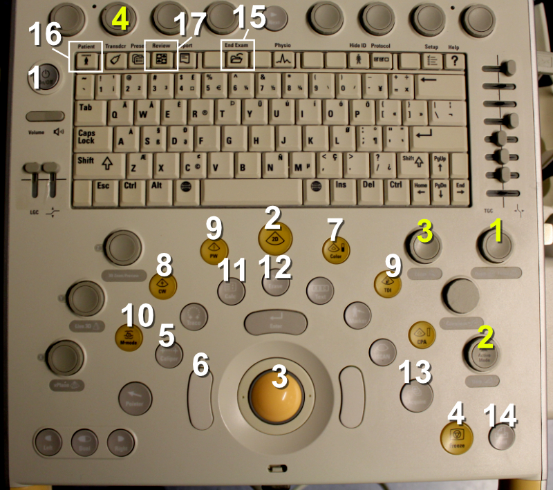

# Echocardiography Device Buttons

The following Figure \@ref(fig:echodevice) presents the most important buttons of the Philips CX50 echocardiography device and their functions in the order of importance as assessed by the undersigned.

***Note! You don't need to memorize the buttons at this point - they will be covered later in connection with each function presented in this guide.***

<br />


(ref:echodevice) Philips CX50 echocardiography device buttons.

```{r echodevice, out.width = '100%', echo=FALSE, fig.cap="(ref:echodevice)"}
 
```


<br/>
<br/>

The most important buttons of the Philips CX50 device (marked with white numbers):

1. **Power button:** you can get very far just by pressing this

2. **2D button:** if the echocardiography device goes into some function from which you want to exit, pressing this button usually returns the device to its "initial state"

3. **Trackball:** this can be used to move the cursor and zoom window, among other things

4. **Freeze:** this stops the moving image into a still image

5. **Caliper:** this allows you to quickly make almost any "quick and dirty" measurements without needing to go into the device's internal, structural measurement parameters (the latter are accessed with the Calc button)

6. **Trackball left button:** necessary for various types of measurements

7. **Color Doppler:** practically mandatory for diagnosing valve regurgitation and stenosis

8. **CW (continuous wave Doppler):** button needed for measuring high-velocity blood flows

9. **PW (pulsed wave Doppler):** button needed for measuring slower blood flows from a specific, cursor-indicated point

10. **M-mode:** M-mode produces a one-dimensional representation of a specific cardiac cross-section as a function of time, which is very useful for measuring left ventricular cross-sectional dimensions and simultaneously the ejection fraction

11. **Calc:** with this button you can name structurally measured dimensions from the heart, whereupon the echocardiography device automatically produces various calculated parameters of cardiac function (e.g., ejection fraction and aortic valve area)

12. **Erase:** this allows you to remove from the display, for example, a measurement deemed erroneous

13. **Acquire:** this allows you to save images and videos taken into the echocardiography device's memory

14. **Print:** this prints the image visible on the display to the printer connected to the echocardiography device

15. **End exam:** this allows you to end the ongoing examination and reset all saved measurements, images, and videos (if saves have been made with the Acquire button, these remain in the echocardiography device's mass memory)

16. **Patient:** patient identification information can be entered through the screen that opens behind this button

17. **Review:** images and videos saved to the echocardiography device can be viewed through the screen that opens behind this button


<br/>
<br/>

The most important "knobs" of the Philips CX50 device (marked with yellow numbers):

1. **Depth:** this allows you to expand or reduce the image area on the echocardiography device's display

2. **Gain:** this allows you to make the image darker or lighter

3. **Zoom:** this allows you to zoom the image

4. **"Baseline knob":** this is the most important knob in the top row - with this you can lower or raise the baseline (= Y-axis origin) when using continuous wave Doppler, for example


<br/>
<br/>
<br/>
<p xmlns:cc="http://creativecommons.org/ns#" xmlns:dct="http://purl.org/dc/terms/"><a property="dct:title" rel="cc:attributionURL" href="https://ukg-opas.netlify.app/">Echo Guidebook</a> © 2022 by <a rel="cc:attributionURL dct:creator" property="cc:attributionName" href="https://www.linkedin.com/in/ville-langen/">Ville Langén</a> is licensed under <a href="https://creativecommons.org/licenses/by-sa/4.0/?ref=chooser-v1" target="_blank" rel="license noopener noreferrer" style="display:inline-block;">CC BY-SA 4.0</a></p>
