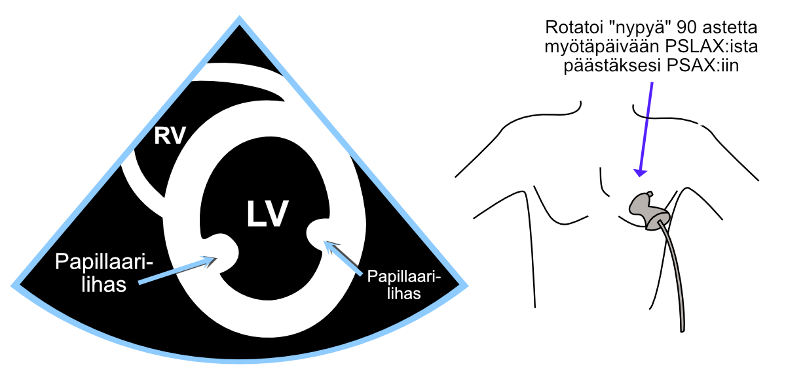
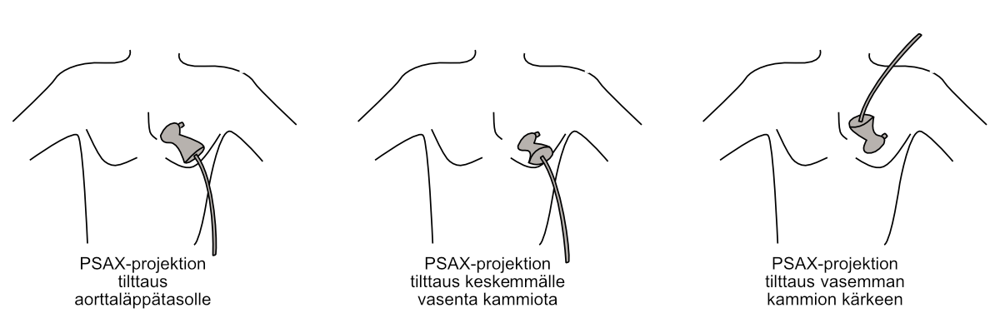
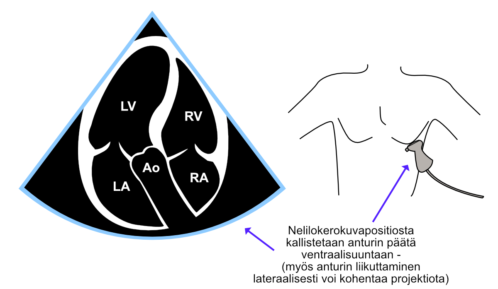
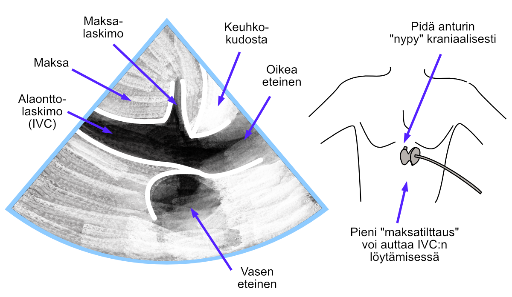

# Projections

The views obtainable in echocardiography cause interpretation difficulties only for very early-stage beginners.

Echocardiography is performed from only a few standard views or projections, where structures are easily visible always "in their own places". Projections are learned quickly, after which the recognition of common cardiac structures - such as valves - does not present any difficulties.

Projections have their own logical and easy letter abbreviations that are worth learning.

## PSLAX

The parasternal long-axis view (PSLAX, parasternal long axis view) is obtained when the transducer is moved from the center of the sternum immediately to the left. The transducer's "bump" must point toward the patient's sternum / right armpit.

<br />


(ref:pslax) Parasternal long-axis view (PSLAX).

```{r pslax, out.width = '100%', echo=FALSE, fig.cap="(ref:pslax)"}
 knitr::include_graphics("images/pslax2.png")
```


## PSAX

The parasternal short-axis view (PSAX, parasternal short axis view) is obtained by rotating the transducer 90 degrees clockwise from the parasternal long-axis view. Sometimes the transducer position needs to be slightly adjusted to restore visibility between the ribs that may have been lost during rotation.

From this projection, you can scan step by step all parts of the left ventricle by tilting (not rotating!) the transducer either toward the aorta or toward the heart's apex. In the extreme position when tilting toward the aorta, you see a cross-section of the aortic valve, and correspondingly, in the extreme position when tilting toward the heart's apex, you see only the left ventricular apex as a small donut-like projection.

In the following figure \@ref(fig:psax), you can see the short-axis view at the level of the left ventricular papillary muscles.

In the lower figure \@ref(fig:psaxtaivutuksia), different tilts of the PSAX projection are presented (the rotation angle remains the same throughout, i.e., 90 degrees clockwise from PSLAX).


<br />


(ref:psax) Parasternal short-axis view (PSAX).

```{r psax, out.width = '100%', echo=FALSE, fig.cap="(ref:psax)"}
 
```


<br />


(ref:psaxtaivutuksia) Tilting of the parasternal short-axis view to different cross-sectional levels.

```{r psaxtaivutuksia, out.width = '100%', echo=FALSE, fig.cap="(ref:psaxtaivutuksia)"}
 
```


## A4C

### Standard method

From the apical view - which is sometimes also called the apex view - a four-chamber view (A4C, apical four chamber view) is imaged. The standard method is to direct the "bump" laterally toward the patient's side, whereupon the left ventricle appears on the right side of the image area - thus imaging "left on the right and right on the left".

This four-chamber projection imaging method can be recommended because it is universal, and because the automated functions of more advanced ultrasound devices are designed for this imaging method.

<br />


(ref:a4cstandardi) Four-chamber view (A4C) imaged with the standard method.

```{r a4cstandardi, out.width = '100%', echo=FALSE, fig.cap="(ref:a4cstandardi)"}
 knitr::include_graphics("images/a4c_and_body_standardi.png")
```


### Alternative method

If, on the other hand, the "bump" is directed toward the patient's body midline, the left ventricle appears on the left side of the image area. Then "left appears on the left and right on the right".

Both four-chamber projection imaging methods - both standard and alternative - can be used and are used here and elsewhere according to echocardiographers' own imaging preferences. I have personally followed this alternative method out of habit, which is why several illustrative images in this guide are presented from the perspective of this alternative imaging method.

<br />


(ref:a4cvaihtoehtoinen) Four-chamber view (A4C) imaged with the alternative method.

```{r a4cvaihtoehtoinen, out.width = '100%', echo=FALSE, fig.cap="(ref:a4cvaihtoehtoinen)"}
 knitr::include_graphics("images/a4c_and_body_vaihtoehtoinen.png")
```


## A5C

The five-chamber view (A5C, apical five chamber view) is relatively easy to form by first obtaining a four-chamber view and then tilting the transducer tip slightly ventrally. Correspondingly, you can return to the four-chamber view by tilting the transducer tip back slightly in the dorsal direction.

The most important significance of the five-chamber view is examinations and measurements directed at the aortic valve, e.g., with color Doppler and continuous wave Doppler.

Sometimes the ventral tilt of the transducer seems to completely lose visibility, and sometimes the aorta opens so obliquely that measurements cannot be made across the aortic valve with continuous wave Doppler. In these cases, it often helps to move the entire transducer along the rib some distance toward the patient's side ("toward the armpit").

<br />


(ref:a5c) Five-chamber view (A5C).

```{r a5c, out.width = '100%', echo=FALSE, fig.cap="(ref:a5c)"}
 
```


## Subcostal projection

The subcostal projection is obtained by placing the transducer vertically immediately caudal to the xiphoid process, with the transducer's "bump" pointing cranially. Often a small cranial tilt toward the heart helps visualize the right atrium in the image (Figure \@ref(fig:subkprojektio)). Additionally, a small tilt toward the liver, which I call "liver tilt," can help visualize the inferior vena cava (IVC).

The "tilts" of the subcostal projection are discussed further in chapter \@ref(icvmittaus).

Subcostally, you can examine other views of different cardiac chambers in addition to the projection presented in Figure \@ref(fig:subkprojektio). I recommend the excellent video from GE Healthcare and Prof. Thomas Binder found [at this link](https://www.youtube.com/watch?v=3y15C3mYocA) about these projections. I also recommend the video found [at this link](https://www.youtube.com/watch?v=MXCvktFy72E) from the YouTube channel BASIC Critical Care Ultrasound, which also presents the subcostal short-axis view.


<br />


(ref:subkprojektio) Subcostal projection.

```{r subkprojektio, out.width = '100%', echo=FALSE,fig.cap="(ref:subkprojektio)"}
 
```


<br/>
<br/>
<br/>
<p xmlns:cc="http://creativecommons.org/ns#" xmlns:dct="http://purl.org/dc/terms/"><a property="dct:title" rel="cc:attributionURL" href="https://ukg-opas.netlify.app/">Echo Guidebook</a> © 2022 by <a rel="cc:attributionURL dct:creator" property="cc:attributionName" href="https://www.linkedin.com/in/ville-langen/">Ville Langén</a> is licensed under <a href="https://creativecommons.org/licenses/by-sa/4.0/?ref=chooser-v1" target="_blank" rel="license noopener noreferrer" style="display:inline-block;">CC BY-SA 4.0</a></p>
