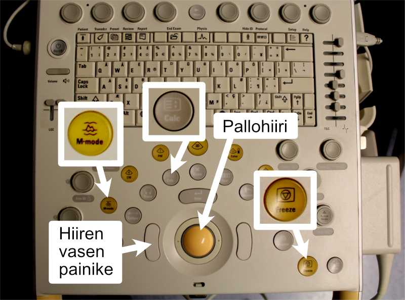
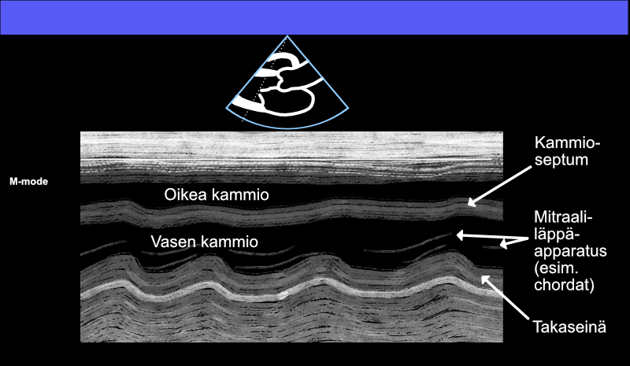
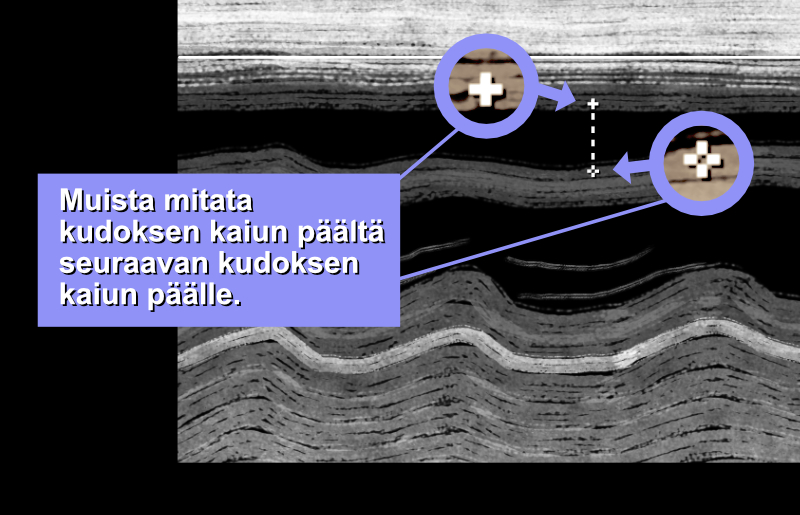
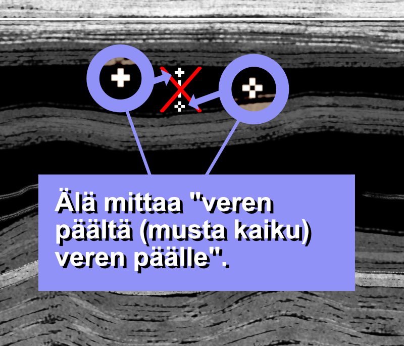
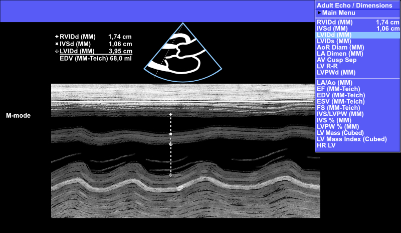
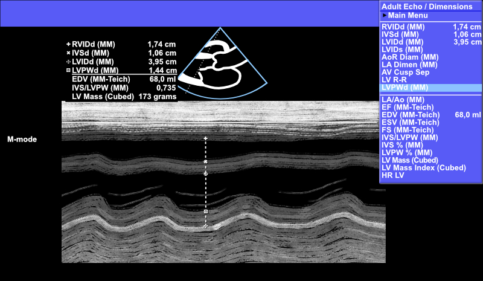
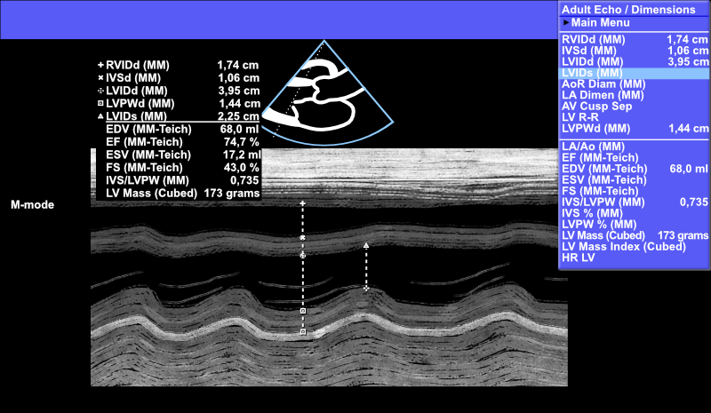
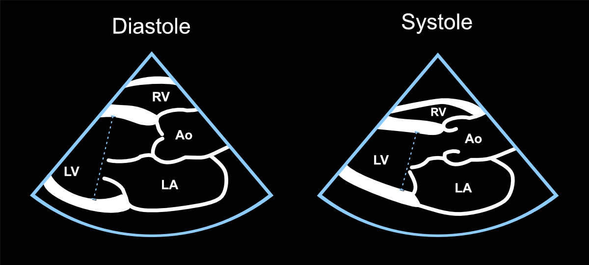

# Left Ventricular Dimensions

## M-mode{#mmoodi}

If visibility is good and the patient's heart position is suitable for imaging technique (Figure \@ref(fig:mmoodimallikuva)), M-mode measurements can quickly provide much useful information about the patient's heart.

To achieve M-mode and perform measurements with it, you need the buttons indicated in the following figure (Figure \@ref(fig:ukglaitemmode)).

<br />

(ref:ukglaitemmode) Buttons and trackball needed to achieve M-mode.

```{r ukglaitemmode, out.width = '100%', echo=FALSE, fig.cap="(ref:ukglaitemmode)", fig.margin = TRUE}
 
```

<br />


## Obtain a Good PSLAX

The echocardiography device starts in the usual 2D mode. In this mode, the very first thing to do is to obtain a good PSLAX projection from the heart (Figure \@ref(fig:mmoodimallikuva)). Low-quality images cannot be used reliably for M-mode measurements.

After this, a suitable cross-sectional line is selected by moving the cursor with the echocardiography device's ***trackball***. The cross-sectional line to be examined is set so that it cuts perpendicularly through the left ventricle immediately distal to the tips of the mitral valve's opening leaflets (Figure \@ref(fig:mmoodimallikuva)).


<br />

(ref:mmoodimallikuva) Quality PSLAX projection and proper cross-sectional line.

```{r mmoodimallikuva, out.width = '100%', echo=FALSE, fig.cap="(ref:mmoodimallikuva)", fig.margin = TRUE}
 knitr::include_graphics("images/mmoodi_mallikuva2.png")
```

<br />


## The Problem of Vertical Heart

If the **heart position** is very **vertical** in the patient (Figure \@ref(fig:pystysydan)), M-mode does not cut the left ventricle perpendicularly, resulting in a **too oblique cut of the left ventricle**. This, among other things, overestimates the left ventricular cross-sectional dimension. If a proper perpendicular cut cannot be achieved, it's not worth wasting time with M-mode but rather use, for example, LVEF measurement from 2D images, which is described later in subsection \@ref(lvef2d).

<br />

(ref:pystysydan) This is not a proper PSLAX projection - don't try to make measurements from such a projection using M-mode.

```{r pystysydan, out.width = '100%', echo=FALSE, fig.cap="(ref:pystysydan)", fig.margin = TRUE}
 knitr::include_graphics("images/mmoodi_pystysydan.jpg")
```

<br />


## Measurable Parameters

If a sufficiently quality PSLAX projection and suitable cross-sectional line have been obtained, press the ***M-mode*** button on the echocardiography device.

M-mode is allowed to roll forward, and if the view appears technically sufficient quality for measurements, the image is stopped with the echocardiography device's ***Freeze*** button (Figure \@ref(fig:mmoodiperusnakyma)).

The actual measurements from the frozen image are made by first selecting the parameter to be measured (e.g., left ventricular cross-sectional dimension in diastole, etc.) from the menus that open by pressing the ***Calc*** button. This is described in more detail later.

<br />

(ref:mmoodiperusnakyma) Basic M-mode view in PSLAX projection.

```{r mmoodiperusnakyma, out.width = '100%', echo=FALSE, fig.cap="(ref:mmoodiperusnakyma)", fig.margin = TRUE}
 
```

<br />


### RV Measurement

The right ventricle (RV) is very rarely measured in this context and projection, but for completeness, RV measurement from M-mode is also presented.

From the echocardiography device's ***Calc*** button, find the menu ***Main Menu*** under which the menu ***Dimensions***. Select it, and then ***RVIDd (MM)***. The selections and the actual measurement from the image are made with the trackball and the mouse's left button.

Measure RV according to the example image below (Figure \@ref(fig:mmoderv)).


<br />

(ref:mmoderv) Right ventricular (RV) measurement using M-mode - rarely performed measurement.

```{r mmoderv, out.width = '100%', echo=FALSE, fig.cap="(ref:mmoderv)", fig.margin = TRUE}
 knitr::include_graphics("images/mmoderv.jpg")
```

<br />

**Note! Don't measure "from blood to blood" (i.e., from black signal to black) in this or any other context, but from tissue signal (gray) to the next (see Figure \@ref(fig:mmodervmagnified) and Figure \@ref(fig:mmodervmagnified2) below).**

<br />

(ref:mmodervmagnified) Always remember to measure from tissue to tissue (cardiac tissue appears gray, not black).

```{r mmodervmagnified, out.width = '100%', echo=FALSE, fig.cap="(ref:mmodervmagnified)", fig.margin = TRUE}
 
```

<br />


(ref:mmodervmagnified2) Don't measure "from blood to blood" (blood appears as black signal).

```{r mmodervmagnified2, out.width = '100%', echo=FALSE, fig.cap="(ref:mmodervmagnified2)", fig.margin = TRUE}
 
```

<br />


### IVS Measurement

Most commonly, measurement is started specifically from the interventricular septum (IVS), i.e., by first selecting ***Main Menu --> Dimensions --> IVSd (MM)*** from behind the ***Calc*** button. However, if you started by measuring RV, the echocardiography device automatically moves to the IVSd MM position.

Measure IVS according to the example image below (Figure \@ref(fig:mmodeivs)).

<br />

(ref:mmodeivs) Interventricular septum (IVS) measurement using M-mode.

```{r mmodeivs, out.width = '100%', echo=FALSE, fig.cap="(ref:mmodeivs)", fig.margin = TRUE}
 knitr::include_graphics("images/mmodeivs.jpg")
```

<br />


### LV Measurement (diastole){#lvmmoodi}

If you measured IVS above, the echocardiography device automatically moves directly to the left ventricular diastolic dimension (LVIDd).

Sometimes the interventricular septum is demarcated so poorly in M-mode that you want to start M-mode measurements directly by measuring LVIDd. In that case, select ***Main Menu --> Dimensions --> LVIDd (MM)*** from behind the ***Calc*** button, and leave IVSd (and RVIDd) unmeasured in this context.

Measure LVIDd according to the example image below (Figure \@ref(fig:mmodelvidd)).

<br />

(ref:mmodelvidd) Left ventricular diastolic diameter (LVIDd) measurement using M-mode.

```{r mmodelvidd, out.width = '100%', echo=FALSE, fig.cap="(ref:mmodelvidd)", fig.margin = TRUE}
 
```

<br />


### LVPW Measurement

If you measured LVIDd above, the echocardiography device automatically moves directly to the left ventricular posterior wall (LVPWd).

Otherwise, you can find it from behind the ***Calc*** button ***Main Menu --> Dimensions --> LVPWd (MM)***.


Measure LVPWd according to the example image below (Figure \@ref(fig:mmodelvpwd)).

<br />

(ref:mmodelvpwd) Left ventricular posterior wall (LVPWd) measurement using M-mode.

```{r mmodelvpwd, out.width = '100%', echo=FALSE, fig.cap="(ref:mmodelvpwd)", fig.margin = TRUE}
 
```

<br />


### LV Measurement (systole)

If you measured LVPWd above, the echocardiography device automatically moves directly to left ventricular measurement in systole (LVIDs).

Otherwise, you can find it from behind the ***Calc*** button ***Main Menu --> Dimensions --> LVIDs (MM)***.


Measure LVIDs according to the example image below (Figure \@ref(fig:mmodelvids)).

<br />

(ref:mmodelvids) Left ventricular systolic diameter (LVIDs) measurement using M-mode.

```{r mmodelvids, out.width = '100%', echo=FALSE, fig.cap="(ref:mmodelvids)", fig.margin = TRUE}
 
```

<br />

The last measurement to be made in M-mode in the PSLAX projection is the LVIDs measurement. After obtaining this measurement, the echocardiography device calculates and displays below the "division line" key calculated parameters (see Figure \@ref(fig:mmodelvidsmagnified) below), which are EDV, EF, ESV, FS, IVS/LVPW, and LV Mass (Cubed).

**In the Turku area, it is typical to express only EF from the calculated parameters in this context, in addition to the actual measurements.**

Mileage may vary - different healthcare districts may have different practices in report preparation. Even the word UKG is used only in certain localities, while in others they may talk about "ekko" instead.

In Turku, M-mode measurements (if RV was not measured) would be expressed concisely from the image below as follows:

<br />

|    *"LV 40/23, from which EF 75 %. Walls 11/14."*

<br />

Note that dimensions are expressed in millimeters in this context, without stating the unit "mm".

<br />


(ref:mmodelvidsmagnified) Dimensions and calculated parameters obtainable from the left ventricle using M-mode measurement.

```{r mmodelvidsmagnified, out.width = '100%', echo=FALSE, fig.cap="(ref:mmodelvidsmagnified)", fig.margin = TRUE}
 knitr::include_graphics("images/mmodelvidsmagnified.jpg")
```


<br />

## LVEF 2D Measurement{#lvef2d}

If a suitable cross-sectional line for quality M-mode cannot be obtained, nothing prevents measuring the left ventricular diameter in diastole and systole directly from 2D images (Figure \@ref(fig:2defmittaus)).

As soon as these measurements are made structurally, the echocardiography device reports the left ventricular ejection fraction.

Most importantly, you must search for LVIDd and LVIDs measurements from behind the Calc button from the submenu Dimensions, so that the echocardiography device understands what measurements you are currently trying to take.

<br />

***In other words, don't do these measurements with the "unnamed measurement" Caliper button!*** 

<br />

(ref:2defmittaus) Left ventricular ejection fraction measurement in 2D mode.

```{r 2defmittaus, out.width = '100%', echo=FALSE, fig.cap="(ref:2defmittaus)", fig.margin = TRUE}
 
```

<br />


<br/>
<br/>
<br/>
<p xmlns:cc="http://creativecommons.org/ns#" xmlns:dct="http://purl.org/dc/terms/"><a property="dct:title" rel="cc:attributionURL" href="https://ukg-opas.netlify.app/">Echo Guidebook</a> © 2022 by <a rel="cc:attributionURL dct:creator" property="cc:attributionName" href="https://www.linkedin.com/in/ville-langen/">Ville Langén</a> is licensed under <a href="https://creativecommons.org/licenses/by-sa/4.0/?ref=chooser-v1" target="_blank" rel="license noopener noreferrer" style="display:inline-block;">CC BY-SA 4.0</a></p>
