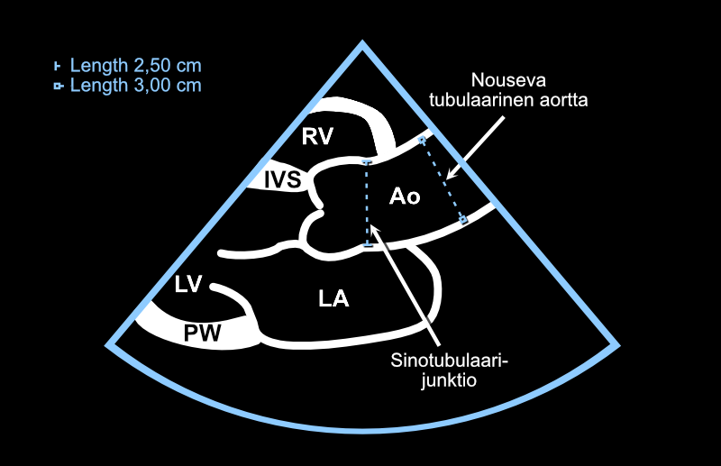

# Aorta (Ao)

## Aortic Root

The beginner can try to memorize the reading 4 cm - generally speaking, **the aortic root should not be wider than 4 cm**.

The measurement is most conveniently performed from the echocardiography device's 2D image using the **Caliper button** in the PSLAX projection. Additionally, you need the mouse's left button and the Print button (Figure \@ref(fig:caliper)).

<br />


(ref:caliper) Caliper and Print buttons and the mouse's left button.

```{r caliper, out.width = '100%', echo=FALSE, fig.cap="(ref:caliper)"}
 knitr::include_graphics("images/ukglaite_caliper_left_print.jpg")
```


<br />

If you express only one measurement from the aorta, it is practically always the aortic root, and it is quite commonly marked in reports with just the **abbreviation "Ao"**.

To measure the aortic root, first stop the moving 2D image with the **Freeze** button. Move the frozen image series with the trackball so that the aortic valve closes. After this, the first Valsalva sinus is marked with the mouse's left button, the second directly with the Print button, whereupon the segment between the sinuses is measured and printed (Figure \@ref(fig:aortantyvi)).


<br />

(ref:aortantyvi) Aortic root measurement from 2D image. The measurement is performed when the aortic valve is closed (end-diastole).

```{r aortantyvi, out.width = '100%', echo=FALSE, fig.cap="(ref:aortantyvi)"}
 knitr::include_graphics("images/aortan_tyvi_end_diastolic3.png")
```


## Aorta: Additional Information

### 2D vs. M-mode Measurement

The aortic root is measured from 2D images [according to current recommendations](https://www.asecho.org/guideline/recommendations-for-cardiac-chamber-quantification-by-echocardiography-in-adults-an-update-from-the-american-society-of-echocardiography-and-the-european-association-of-cardiovascular-imaging/). **The aim is to measure the maximum diameter from the base of one Valsalva sinus to the base of another.**

You will see that many colleagues still use M-mode for measuring the aortic root (and simultaneously the left atrium) and may be very skilled at this. However, in practice, it is difficult to get the M-mode cursor in a moving image to hit exactly such an angle that the measurement is taken representing the maximum diameter between the Valsalva sinuses. **Therefore, I always measure aortic dimensions only from 2D images.** Another reason is saving time: I personally find that hunting for a sufficiently good angle in M-mode would often take more time than immediate 2D measurements. In this guide, aortic root measurement using M-mode is not covered.


### Other Aortic Dimensions

Regarding reporting of aortic dimensions, my experience is as follows: if the term Ao is used in an echocardiographic study performed in the Turku area, this usually describes specifically the aortic root. This is sometimes - but by no means always - followed by other aortic dimensions. If you report multiple aortic dimensions in your report, it might be wisest not to use the abbreviation Ao at all but rather unpack that abbreviation into the form "aortic root."

The field's umbrella organizations [ASE and EACVI emphasize](https://www.asecho.org/guideline/recommendations-for-cardiac-chamber-quantification-by-echocardiography-in-adults-an-update-from-the-american-society-of-echocardiography-and-the-european-association-of-cardiovascular-imaging/) that only the aortic annulus measurement is performed in mid-systole (Figure \@ref(fig:annulus)), all other measurements in end-diastole (Figure \@ref(fig:stj)). (However, I haven't found/read these umbrella organizations' recommendations for aortic arch measurement, so I haven't paid much attention to the systole vs. diastole question there.)

<br />
<br />


```{r aorttataulukko, echo=FALSE, warning=FALSE, message=FALSE}
library(tidyverse)
library(kableExtra)

aorttataulukko <- tibble::tribble(
  ~`Aortic dimension`, ~`Measurement timing`, ~`From whom measured`,
  "Aortic annulus", "Mid-systole", "E.g., TAVI candidates",
  "Aortic root", "End-diastole", "**Always**",
  "STJ", "End-diastole", "At least when aortic dilation",
  "ATA", "End-diastole", "At least when aortic dilation",
  "Aortic arch", "(no guidance)", "At least when aortic dilation"
)

knitr::kable(aorttataulukko, label=NA,
             caption = 'Aortic dimensions typically measured with echocardiography.') %>%
  footnote(
    general = "STJ, sinotubular junction. ATA, ascending tubular aorta.",
    general_title = "Abbreviations:"
  )
```


<br />

(ref:stj) Sinotubular junction and ascending tubular aorta. The measurement is performed in end-diastole.

```{r stj, out.width = '100%', echo=FALSE, fig.cap="(ref:stj)"}
 
```
<br />


<br />

(ref:annulus) The aortic annulus is measured in mid-systole.

```{r annulus, out.width = '100%', echo=FALSE, fig.cap="(ref:annulus)"}
 
```
<br />


According to [ASE and EACVI](https://www.asecho.org/guideline/recommendations-for-cardiac-chamber-quantification-by-echocardiography-in-adults-an-update-from-the-american-society-of-echocardiography-and-the-european-association-of-cardiovascular-imaging/), aortic dimensions should be expressed using the so-called *leading edge-to-leading edge* principle. For clarity, however, in this guide all cross-sectional measurements from 2D images are presented using the *inner edge-to-inner edge* principle. I limit the treatment of these principles outside this guide. You can read more about this if you wish, for example, from [Oxborough and colleagues' article](https://www.researchgate.net/publication/262142708_Impact_of_Methodology_and_the_use_of_Allometric_Scaling_on_the_Echocardiographic_Assessment_of_the_Aortic_Root_and_Arch_A_Study_by_the_Research_and_Audit_Sub-Committee_of_the_British_Society_of_Echoca).


### Aortic Reference Values

As mentioned above, the aortic root should not be wider than 4 cm.

Generally, the aorta narrows at the sinotubular junction, and the ascending tubular aorta is also narrower than the aortic root. More precise individual reference values for different aortic dimensions can be examined if necessary from [treatment recommendations.](https://www.asecho.org/guideline/recommendations-for-cardiac-chamber-quantification-by-echocardiography-in-adults-an-update-from-the-american-society-of-echocardiography-and-the-european-association-of-cardiovascular-imaging/) 


<br />


<br/>
<br/>
<br/>
<p xmlns:cc="http://creativecommons.org/ns#" xmlns:dct="http://purl.org/dc/terms/"><a property="dct:title" rel="cc:attributionURL" href="https://ukg-opas.netlify.app/">Echo Guidebook</a> © 2022 by <a rel="cc:attributionURL dct:creator" property="cc:attributionName" href="https://www.linkedin.com/in/ville-langen/">Ville Langén</a> is licensed under <a href="https://creativecommons.org/licenses/by-sa/4.0/?ref=chooser-v1" target="_blank" rel="license noopener noreferrer" style="display:inline-block;">CC BY-SA 4.0</a></p>
