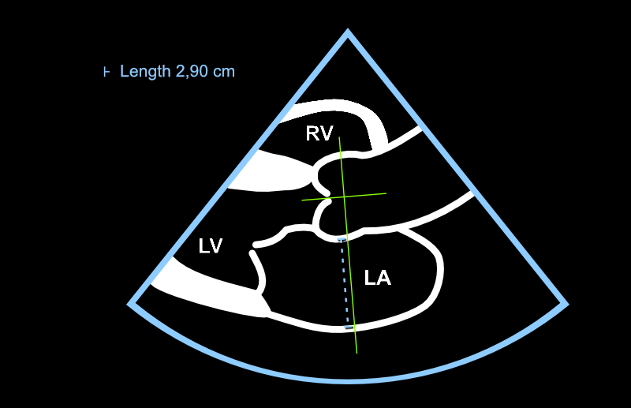

# Left Atrium (LA)


## LA Measurement

The size of the left atrium depends on the patient's size. However, the beginner can memorize that the **rough reference upper limit for the cross-sectional dimension is 4 cm**.

Left atrial measurement is timed to end-systole. In practice, you shouldn't stress about timing, as **the measurer can simply try to select a frame where the left atrium appears to be at its largest**.

Measurement from 2D images is performed most simply with the echocardiography device's **Caliper button** (see chapter \@ref(caliper)). The Valsalva sinus visible in the "roof" of the left atrium is marked with the mouse's left button and the left atrial posterior wall directly with the Print button (Figure \@ref(fig:vaseneteinen)) in the PSLAX projection.

<br/>

(ref:vaseneteinen) The left atrium is measured with a line that extends from the Valsalva sinus to the left atrial posterior wall in end-systole. The direction of the line must be perpendicular to the imaginary long axis of the aortic root.

```{r vaseneteinen, out.width = '100%', echo=FALSE, fig.cap="(ref:vaseneteinen)", fig.margin = TRUE}
 
```


## LA: Additional Information

### LA: 2D vs. M-mode Measurement

As with aortic root measurement, many colleagues are skilled at using M-mode for left atrial measurement as well. However, it is now [more recommended](https://www.asecho.org/guideline/recommendations-for-cardiac-chamber-quantification-by-echocardiography-in-adults-an-update-from-the-american-society-of-echocardiography-and-the-european-association-of-cardiovascular-imaging/) to determine the left atrial cross-sectional dimension directly from 2D images.

Most [recommended](https://www.asecho.org/guideline/recommendations-for-cardiac-chamber-quantification-by-echocardiography-in-adults-an-update-from-the-american-society-of-echocardiography-and-the-european-association-of-cardiovascular-imaging/) would be to perform left atrial measurement from two planes by drawing from apical views. **However, in this review aimed at beginners, we focus on the simpler cross-sectional dimension determination**, which should be known in any case. The limitations of a single cross-sectional dimension must be understood; the left atrium may be enlarged in such a direction that a cross-sectional measurement performed from the standard position does not recognize the chamber's enlargement. 


### LA: The Heart's "Long Sugar"

The left atrium enlarges in many heart-straining situations. Examples include left ventricular hypertrophy (and the resulting diastolic dysfunction), mitral valve regurgitation, and mitral valve stenosis. An experienced echocardiographer quickly gains an understanding of the heart's left side status just by glancing at the left atrium - the left atrium is somewhat equivalent to a biomarker for the heart as "long sugar" is for diabetes diagnosis.


### LA's More Precise Reference Values

More precise reference values can be found in the umbrella organizations' [treatment recommendations.](https://www.asecho.org/guideline/recommendations-for-cardiac-chamber-quantification-by-echocardiography-in-adults-an-update-from-the-american-society-of-echocardiography-and-the-european-association-of-cardiovascular-imaging/) 


<br/>
<br/>
<br/>
<p xmlns:cc="http://creativecommons.org/ns#" xmlns:dct="http://purl.org/dc/terms/"><a property="dct:title" rel="cc:attributionURL" href="https://ukg-opas.netlify.app/">Echo Guidebook</a> © 2022 by <a rel="cc:attributionURL dct:creator" property="cc:attributionName" href="https://www.linkedin.com/in/ville-langen/">Ville Langén</a> is licensed under <a href="https://creativecommons.org/licenses/by-sa/4.0/?ref=chooser-v1" target="_blank" rel="license noopener noreferrer" style="display:inline-block;">CC BY-SA 4.0</a></p>
