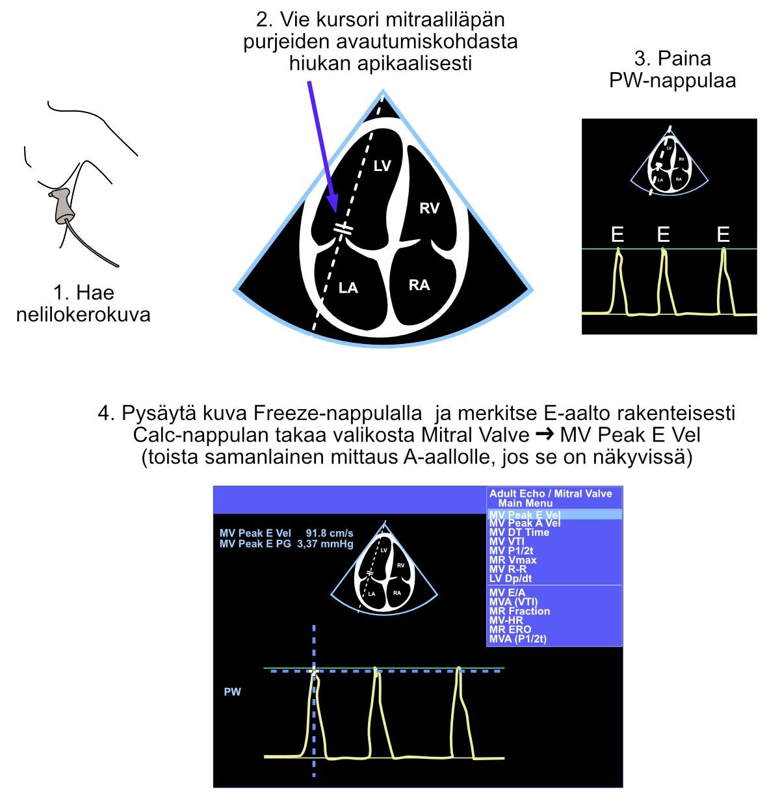
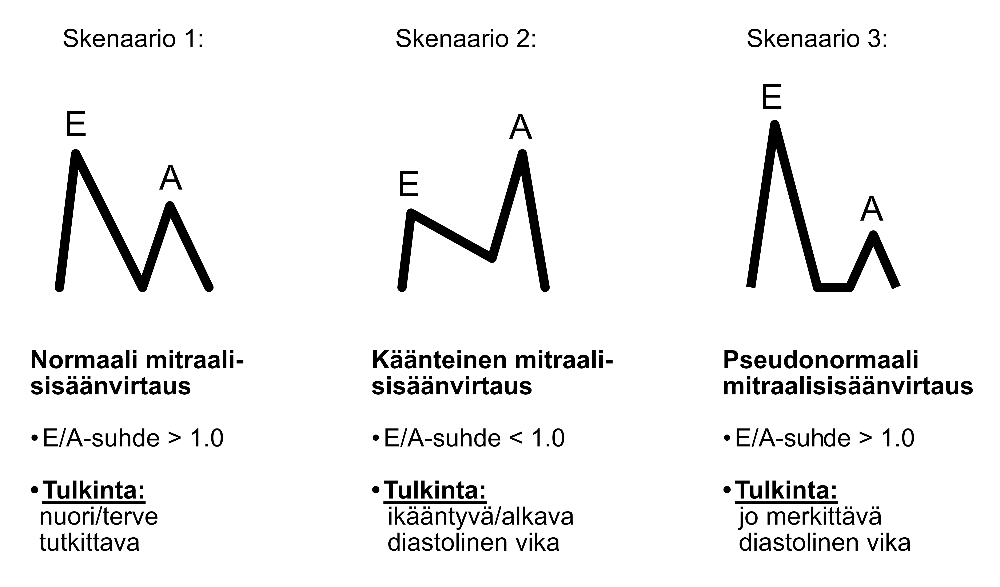
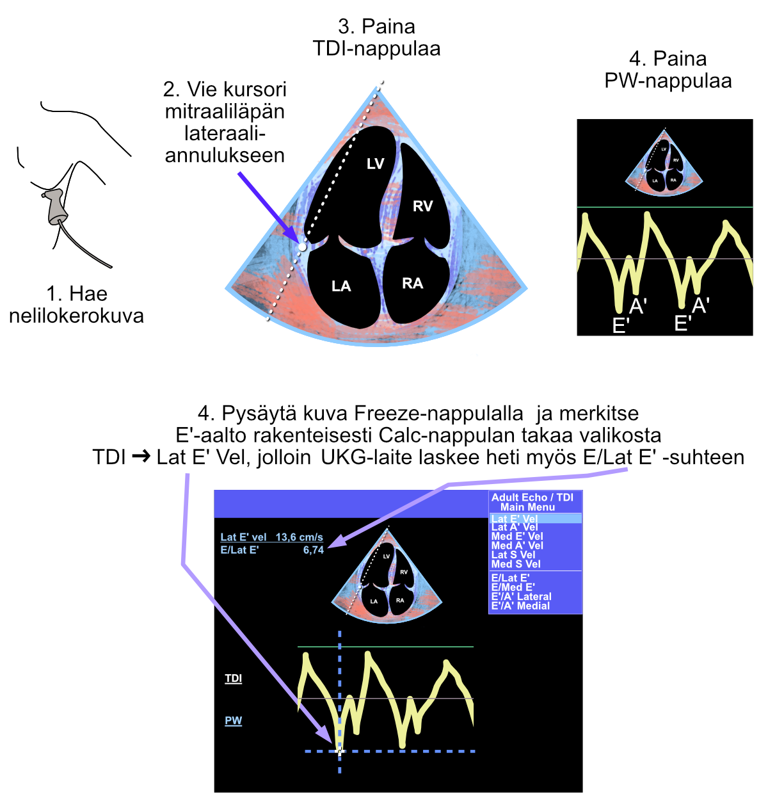

# Diastology

For deeper understanding of diastology, you can familiarize yourself with the [joint recommendation for assessment of diastolic function with echocardiography](https://www.asecho.org/guideline/recommendations-for-the-evaluation-of-left-ventricular-diastolic-function-by-echocardiography-an-update-from-the-american-society-of-echocardiography-and-the-european-association-of-cardiovascular-im/) from echocardiography umbrella organizations (ASE, American Society of Echocardiography, and EACVI, European Association of Cardiovascular Imaging). The said recommendation doesn't start from the very basics of measurements, so I think it's worth reading through this guide first.

Especially for a beginning echocardiographer, I think it would be worth starting from the following three easily learnable basic measurements:

1. Measurement of different wave velocities of mitral inflow using pulsed-wave Doppler (E- and A-waves)
2. Measurement from the mitral valve's lateral annulus using tissue Doppler (E'-wave)
3. Assessment of left ventricular wall thicknesses

The previous three can still be supported if necessary by echocardiographic measurements of left atrial size and pulmonary pressure.

***In practice, with echocardiographic diastology measurements, we try to guess whether the patient's left ventricular filling pressure is normal or abnormal. We wouldn't find out the actual filling pressure except by invasively inserting a pressure catheter into the patient's heart.***


## E- and A-waves

If the patient is in sinus rhythm, two separate waves are seen in diastole when the mitral valve opens, observed with pulsed-wave Doppler, which describe blood flow into the left ventricle:

1) First the **E-wave** (comes from the word *early*), which is generated when the mitral valve opens
   - flow into the left ventricle occurs because there is greater pressure in the left atrium at that time than in the left ventricle

2) Then the **A-wave** (comes from the word *atrium*)
   - flow is generated by the left atrium contracting and pushing blood into the left ventricle

Mitral inflow measurement using pulsed-wave Doppler is described below (Figure \@ref(fig:diastoliikkapw)).

***Note. If the patient is in atrial fibrillation, there is no proper contraction in the left atrium but chaotic fibrillation, so the A-wave is not seen.***


<br />


(ref:diastoliikkapw) Pulsed-wave Doppler measurement of mitral inflow from the four-chamber view. In this hypothetical example case, the patient is in atrial fibrillation, so only E-waves are visible (note the irregular rhythm).

```{r diastoliikkapw, out.width = '100%', echo=FALSE, fig.cap="(ref:diastoliikkapw)"}
 
```


<br />


## E- and A-waves: Interpretation


The key measurements from E- and A-waves are the peak points of each wave, which represent the maximum velocities of the corresponding blood flows. From these velocities - and their mutual ratio - you can make the following conclusions about the heart's diastolic function (Figure \@ref(fig:mitraalisisaanvirtaus)):

1. In young healthy patients, the E-wave is larger than the A-wave
   - E/A ratio > 1.0
2. In mild diastolic dysfunction and with aging, the E/A ratio becomes inverted
   - E/A ratio < 1.0
3. In more severe diastolic dysfunction, the E/A ratio becomes pseudonormal
   - E/A ratio > 1.0


<br />


(ref:mitraalisisaanvirtaus) Different scenarios of mitral inflow.

```{r mitraalisisaanvirtaus, out.width = '100%', echo=FALSE, fig.cap="(ref:mitraalisisaanvirtaus)"}
 
```


<br />


Since the above-mentioned scenarios 1 and 3 visually resemble each other (Figure \@ref(fig:mitraalisisaanvirtaus)), a beginning echocardiographer might think that this doesn't cause significant difficulties in determining whether the heart's diastolic function is completely normal or quite abnormal. In practice, more experienced echocardiographers rarely have difficulty distinguishing normal and pseudonormal mitral inflow from each other. The patient's age and other observations made in the echocardiographic study help distinguish these scenarios from each other.

***Most importantly, I think it's worth remembering that if you see a "normal" E/A ratio in an elderly person, it is rarely if ever actually normal. In elderly patients, there is practically always either inverted mitral inflow (scenario 2 above) or pseudonormal mitral inflow (scenario 3 above). For some reason, this simple mnemonic is not emphasized in the literature.***


## Tissue Doppler (TDI)

With traditional Doppler, measurements are made of blood flows in the heart. With tissue Doppler (TDI), on the other hand, myocardial velocities are examined.

When assessing diastology, the cursor is moved with the trackball to the myocardial area between the left ventricle and left atrium, immediately lateral to the mitral annulus. From the echocardiography device, press the TDI button and immediately after the PW button. Thus observed, E- and A-waves are seen with tissue Doppler as if inverted, downward-directed (Figure \@ref(fig:diastoliikkatdi)). These are called E'- and A'-waves in this context (pronounced in English as "E prime" and "A prime").

The E'-wave can also be measured from the mitral valve's medial annulus, but for simplification, I present only the lateral measurement technique in this guide.

Note. If the patient is in atrial fibrillation, again no A-wave (or more correctly called A'-wave in the context of tissue Doppler) is seen.


<br />


(ref:diastoliikkatdi) Measurement made with tissue Doppler in diastology assessment. Note the blue-red image, which is seen as an indication of tissue Doppler activation. Since both E'- and A'-waves are seen, the patient is in sinus rhythm.

```{r diastoliikkatdi, out.width = '100%', echo=FALSE, fig.cap="(ref:diastoliikkatdi)"}
 
```

 


<br />

## TDI Interpretation

E- and A-wave interpretation was covered above (Figure \@ref(fig:mitraalisisaanvirtaus)). 

When both E- and E'-waves are measured structurally (named using the Calc button), the echocardiography machine automatically calculates the E/Lat E' ratio.

[Research has shown](https://pubmed.ncbi.nlm.nih.gov/12633827/) that the E/E' ratio is directly related to pulmonary capillary wedge pressure (PCWP) and thus practically to left ventricular filling pressure.

***If E/Lat E' is over 13, the result is abnormal*** and suggestive of increased left ventricular filling pressure (diastolic dysfunction) [according to the field's umbrella organizations](https://www.asecho.org/guideline/recommendations-for-the-evaluation-of-left-ventricular-diastolic-function-by-echocardiography-an-update-from-the-american-society-of-echocardiography-and-the-european-association-of-cardiovascular-im/).


<br/>
<br/>
<br/>
<p xmlns:cc="http://creativecommons.org/ns#" xmlns:dct="http://purl.org/dc/terms/"><a property="dct:title" rel="cc:attributionURL" href="https://ukg-opas.netlify.app/">Echo Guidebook</a> © 2022 by <a rel="cc:attributionURL dct:creator" property="cc:attributionName" href="https://www.linkedin.com/in/ville-langen/">Ville Langén</a> is licensed under <a href="https://creativecommons.org/licenses/by-sa/4.0/?ref=chooser-v1" target="_blank" rel="license noopener noreferrer" style="display:inline-block;">CC BY-SA 4.0</a></p>
