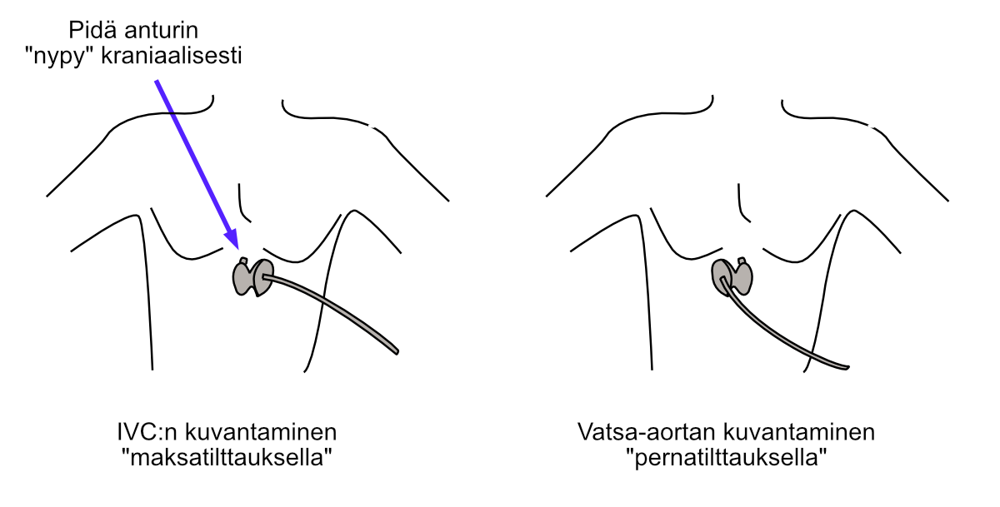
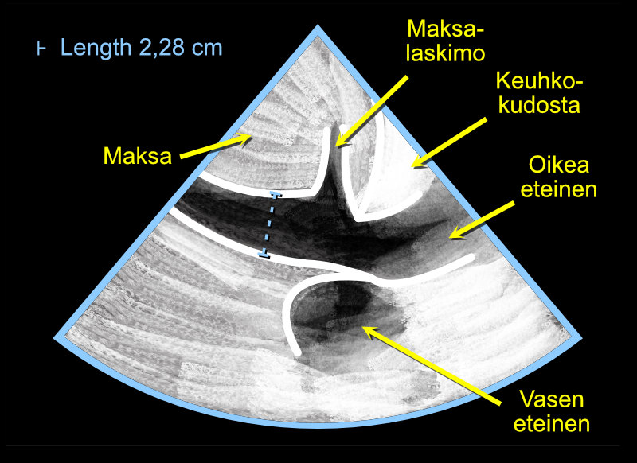

# IVC Measurement{#icvmittaus}

## Measurement Location

Even a beginning echocardiographer usually finds the inferior vena cava (IVC) quite easily from the subcostal projection. However, in some patients, the subcostal window doesn't offer any diagnostic visibility, [which may be due to, for example, bowel gas](https://pubmed.ncbi.nlm.nih.gov/38222871/).

I have noticed that beginners sometimes confuse measurements between the inferior vena cava and abdominal aorta. To solve this, I have launched a principle by which they can be easily distinguished from each other (Figure \@ref(fig:ivcmittauspaikka)):

1) first the inferior vena cava is identified by tilting, which I call **"liver tilt"**
2) after this, the abdominal aorta is identified by **"spleen tilt"**.

Once both the inferior vena cava and abdominal aorta have been identified, they cannot be confused with each other.


<br />

(ref:ivcmittauspaikka) Identification of inferior vena cava and abdominal aorta using "liver and spleen tilting".

```{r ivcmittauspaikka, out.width = '100%', echo=FALSE, fig.cap="(ref:ivcmittauspaikka)", fig.margin = TRUE}
 
```

<br />


## 2D Image Measurement

I recommend measuring the inferior vena cava (IVC) from 2D images. Often you cannot get a completely perpendicular cut of the IVC from M-mode, and achieving such a cut takes unnecessary time, especially from a beginner.

The IVC should not be measured right at the hepatic vein junction but about 1-3 cm "toward the feet," as demonstrated in the image below (Figure \@ref(fig:ivc)).

Images are recorded from the IVC both during expiration and inspiration. You don't need to think separately about which phase of breathing was going on: simply measure the IVC at the same location at its widest and narrowest.

I recommend that you try to get some view of the right atrium as well (Figure \@ref(fig:ivc)). The IVC connects to the right atrium, so you can be sure you're taking measurements from exactly the IVC. Transducer tilts, which I already presented above, also help in IVC identification (Figure \@ref(fig:ivcmittauspaikka)).

***Note! The limitations of IVC measurements in fluid status assessment must be recognized!***

I recommend reading, for example, [Marik and colleagues' review on the topic.](https://www.sciencedirect.com/science/article/pii/S0012369208601634) For example, [significant tricuspid regurgitation](https://pubmed.ncbi.nlm.nih.gov/27107754/) can complicate volume status assessment based on the IVC, of which I also have plenty of clinical experience.

<br />

(ref:ivc) Measuring the diameter of the inferior vena cava (IVC) using the Caliper button. Note. Measure the diameter both during expiration and inspiration.

```{r ivc, out.width = '100%', echo=FALSE, fig.cap="(ref:ivc)", fig.margin = TRUE}
 
```

<br />


## CVP Inference from IVC

Echocardiography umbrella organizations have [presented a very simple principle](https://www.onlinejase.com/article/S0894-7317(10)00434-7/fulltext) by which CVP can be inferred from the IVC in an instant. This principle is presented in the following table.


<br />

```{r cvp, tidy=FALSE, echo=FALSE, warning=FALSE, message=FALSE}
library(tidyverse)
tibble::tribble(
                
        
   ~"Condition",                                                     ~"CVP (mmHg)",     ~"Interpretation",
                                 
   "IVC ≤ 2.1 cm and collapses > 50 % with 'sniffing'",              "3",               "CVP normal",
   "IVC > 2.1 cm and collapses < 50 % with 'sniffing'",              "15",              "CVP high",
   "all other possible measurement scenarios",                  "8",              "CVP moderate"
   

  ) -> cvp_data

knitr::kable((cvp_data), booktabs = TRUE,
caption = 'CVP inference from IVC.')


```


<br />

Examples:

Finding                            CVP (mmHg)
--------------------------------  ------------
IVC 1.5 cm and collapses > 50 %     3 
IVC 2.7 cm and collapses < 50 %     15         
IVC 1.5 cm but collapses < 50 %     8          
IVC 2.7 but collapses > 50 %        8          

<br/>
<br/>
<br/>
<p xmlns:cc="http://creativecommons.org/ns#" xmlns:dct="http://purl.org/dc/terms/"><a property="dct:title" rel="cc:attributionURL" href="https://ukg-opas.netlify.app/">Echo Guidebook</a> © 2022 by <a rel="cc:attributionURL dct:creator" property="cc:attributionName" href="https://www.linkedin.com/in/ville-langen/">Ville Langén</a> is licensed under <a href="https://creativecommons.org/licenses/by-sa/4.0/?ref=chooser-v1" target="_blank" rel="license noopener noreferrer" style="display:inline-block;">CC BY-SA 4.0</a></p>


          
