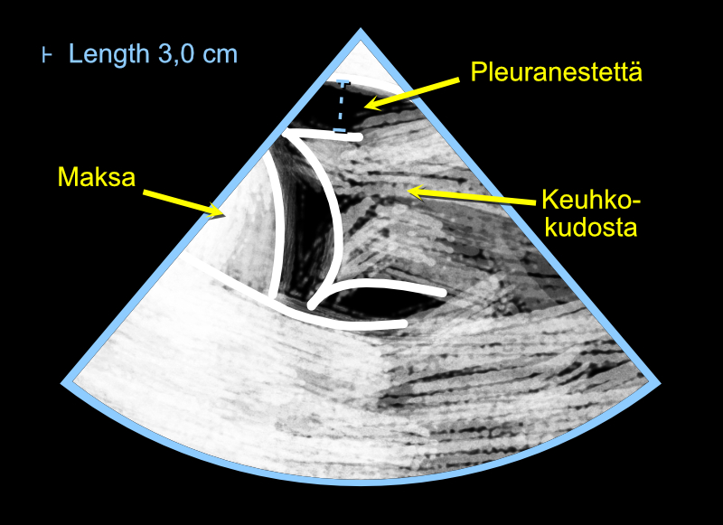

# Lung Congestion Assessment

## Pleural Effusion

I recommend assessing the amount of pleural effusion by placing the transducer in a vertical position on the mid-axillary line on the patient's side. I think it's important to keep the transducer marker always pointing toward the armpit (Figure \@ref(fig:pleuralus)), so that the liver appears on the left side of the image and the lungs on the right side - then there are never difficulties in image interpretation.


<br />

(ref:pleuralus) Measuring the inferior vena cava (IVC) using the Caliper button.

```{r pleuralus, out.width = '100%', echo=FALSE, fig.cap="(ref:pleuralus)", fig.margin = TRUE}
 knitr::include_graphics("images/pleural_us2.png")
```

<br />


Lung tissue is easily distinguished from other tissues because the lungs often show a few comets (B-lines), more about these below. You won't find B-lines, for example, in the liver.

If there are thoughts of puncturing the pleural effusion for one reason or another, it's worth assessing the distance of the lungs from the puncture site using the Caliper button (Figure \@ref(fig:keuhkot)). I recommend familiarizing yourself with the literature - and above all consulting a senior - regarding safe puncture margins.

Note! If you suspect the patient has excess pleural effusion but can't find it with the ultrasound device, the transducer should be placed very posteriorly, practically so that it already touches the sheet. When the patient is supine, you see that pleural effusion collects posteriorly due to gravity.

<br />

(ref:keuhkot) Assessing the amount of pleural effusion using a cardiac ultrasound device.

```{r keuhkot, out.width = '100%', echo=FALSE, fig.cap="(ref:keuhkot)", fig.margin = TRUE}
 
```

<br />


## B-lines

The moisture of the lung tissue itself is determined from B-lines. They are artifacts appearing in lung ultrasound that look like comets, which the clinician can utilize in diagnostics (Figure \@ref(fig:bviivat)). B-lines have several criteria, here are some of them:

- they look like comets and are vertical (not horizontal)
- they move from side to side as the visceral and parietal pleura slide against each other (I call this phenomenon that B-lines are "like windshield wipers")
- they continue from the pleura downward through the entire ultrasound view (they don't disappear in the middle of the view)

According to [Lichtenstein and Mezière](https://www.ncbi.nlm.nih.gov/pmc/articles/PMC3734893/), three B-lines or more in one view (practically: in one intercostal space) is abnormal. I warmly recommend reading more about B-lines from [their excellent article](https://www.ncbi.nlm.nih.gov/pmc/articles/PMC3734893/), which is freely available in PubMed Central - the article has plenty of images and recommendations for measurement locations.

Likewise, Via et al. have written a very informative article on the topic, which with its numerous images can be downloaded for free from [Minerva Anestesiologica's pages](https://www.minervamedica.it/en/journals/minerva-anestesiologica/article.php?cod=R02Y2012N11A1282) (in the middle of the page there is small text "PDF", pressing which opens the original article's PDF file).

The above-mentioned articles also tell important information about B-lines' differential diagnosis: B-lines are not always an indication of lung congestion but can indicate, among other things, pneumonia.

B-lines are living proof of Goethe's wisdom: "You see only what you know". Many who perform echocardiography professionally see B-lines thousands of times in their lives "accidentally" when imaging the heart, but don't understand their significance.


<br />

(ref:bviivat) Assessing lung congestion by looking for B-lines.

```{r bviivat, out.width = '100%', echo=FALSE, fig.cap="(ref:bviivat)", fig.margin = TRUE}
 knitr::include_graphics("images/b_viivat.jpg")
```

 

<br/>
<br/>
<br/>
<p xmlns:cc="http://creativecommons.org/ns#" xmlns:dct="http://purl.org/dc/terms/"><a property="dct:title" rel="cc:attributionURL" href="https://ukg-opas.netlify.app/">Echo Guidebook</a> © 2022 by <a rel="cc:attributionURL dct:creator" property="cc:attributionName" href="https://www.linkedin.com/in/ville-langen/">Ville Langén</a> is licensed under <a href="https://creativecommons.org/licenses/by-sa/4.0/?ref=chooser-v1" target="_blank" rel="license noopener noreferrer" style="display:inline-block;">CC BY-SA 4.0</a></p>
          
