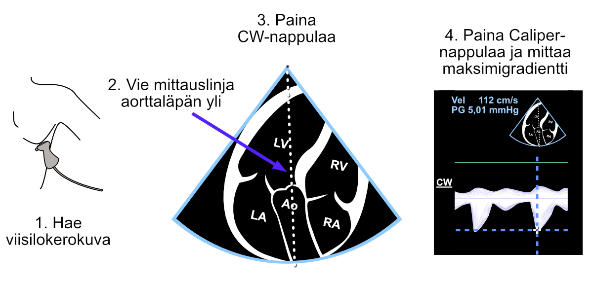
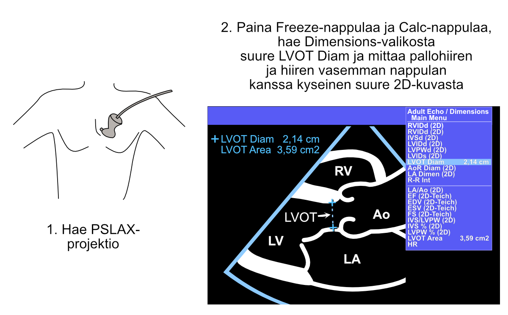
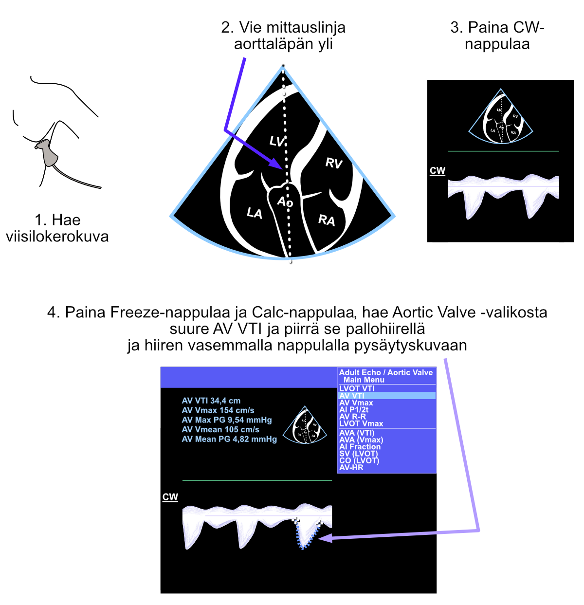

# Aortic Stenosis

According to [the European Society of Cardiology](https://academic.oup.com/eurheartj/article/43/7/561/6358470), aortic stenosis is the most common valve defect requiring invasive intervention in Europe and North America.

A clinician learning echocardiography learns quite quickly to rule out aortic stenosis without continuous wave and pulsed-wave Doppler numerical measurements, just by visual examination.

The following presents the key methods in echocardiographic diagnostics of aortic stenosis.

## Visual Examination

Especially the parasternal long-axis view (PSLAX) and short-axis view (PSAX) are useful for examining the aortic valve's opening movement. If there is abundant calcium in the valve and its opening movement appears poor, aortic stenosis should be suspected.

## Color Doppler

If there are no restrictions in the blood flow path such as aortic stenosis, the color Doppler signal appears unicolored (laminar flow). This is beautifully described in 123sonography's YouTube video, which you can find [at this link](https://www.youtube.com/watch?v=uJ5mtdqo1So).

If blood passes through a narrowed channel, a mosaic-like color Doppler signal is seen, where yellow colors are emphasized (turbulent flow). An example of this can be seen in Mayo Clinic's YouTube video around 1:55, [here's the link to that video](https://www.youtube.com/watch?v=tDloJNmdhuk).

Whenever turbulent flow is seen in the aortic valve position, aortic stenosis should be suspected.

## Continuous Wave Doppler

Continuous wave Doppler is extremely central in the diagnostics of aortic stenosis. The measurement steps are described below (Figure \@ref(fig:avgradientti)).

***My own rule of thumb is that if the velocity glanced at with just the Caliper button is at least 4 m/s (corresponds to a 65 mmHg difference between the left ventricle and aorta), the diagnosis of severe aortic stenosis is clear, and the clinician doesn't necessarily need more precise measurements from behind the Calc button.***


<br />

(ref:avgradientti) Gradient measurement "unnamed" with the Caliper button across the aortic valve from the continuous wave Doppler signal.

```{r avgradientti, out.width = '100%', echo=FALSE, fig.cap="(ref:avgradientti)"}
 
```
<br />

Especially if the velocity glanced at with the Caliper button suggests moderate but not yet severe aortic stenosis, it's worth additionally measuring the aortic valve area (AVA) using the continuity equation. In that case, the velocity measured with the Caliper button doesn't work in the equation, because the echocardiography device doesn't understand what velocity the echocardiographer measured with it - the measurement must be made structurally as the AV Vmax parameter (or AV VTI parameter).


## Valve Area (AVA){#AVA}

The aortic valve area (AVA) measurement is performed using the continuity equation. Fortunately, you don't need to enter the continuity equation yourself, but the echocardiography device calculates and reports it immediately when the following three parameters have been measured structurally (i.e., when measuring parameters that open from behind the Calc button):

1. Diameter of the left ventricular outflow tract (LVOT) (Figure \@ref(fig:lvotdiam))
2. Blood flow velocity across the aortic valve (Figure \@ref(fig:asavmax))
3. Blood flow velocity in the outflow tract (Figure \@ref(fig:lvotpw))

The continuity equation is something that can be understood with common sense. We can measure key parameters related to blood flow at the LVOT, and at the same time we know that blood cannot disappear into any wormhole after the LVOT but must go through the aortic valve.

Thus 1) the diameter (and simultaneously the area) measured from the LVOT and 2) the amount of blood flow help calculate the aortic valve area, once we know 3) the blood flow also at the aortic valve. These measurements are presented in the following.

### LVOT Diameter

First of all, the LVOT diameter must be measured, from which the echocardiography device then automatically determines the LVOT area as well. LVOT measurement is made structurally from 2D images (Figure \@ref(fig:lvotdiam)).

***Note. Don't use the Caliper button for LVOT measurement, because then the echocardiography device doesn't know what structure you measured.*** 


<br />

(ref:lvotdiam) Measurement of the left ventricular outflow tract (LVOT) diameter.

```{r lvotdiam, out.width = '100%', echo=FALSE, fig.cap="(ref:lvotdiam)"}
 
```

<br />


### CW Measurement Across the Aortic Valve


After this, continuous wave Doppler (CW) measurement is made across the aortic valve. Just maximum velocity measurement would work for the continuity equation, but it's conventional to draw the entire envelope curve from the continuous wave Doppler signal across the aortic valve. By doing this, in addition to the maximum gradient, you also get the mean gradient across the aortic valve as a side benefit, and both are usually documented in the echocardiographic report (Figure \@ref(fig:asavmax)).


<br />

(ref:asavmax) Measurement of the left ventricular outflow tract (LVOT) diameter.

```{r asavmax, out.width = '100%', echo=FALSE, fig.cap="(ref:asavmax)"}
 
```

<br />


### PW Measurement from LVOT


Finally, the flow velocity is measured with pulsed-wave Doppler (PW) from the left ventricular outflow tract (LVOT). Here too, just maximum velocity measurement would work for the continuity equation, but it's conventional to draw the entire envelope curve from the pulsed-wave Doppler signal. At the same time, in addition to the AVA, you also find out the left ventricular stroke volume (SV) as a side benefit, and it too can be documented in the echocardiographic report. The echocardiography device reports the AVA and SV immediately when the LVOT diameter, flow velocity from the aortic valve, and flow velocity from the LVOT have been measured (Figure \@ref(fig:lvotpw)).


<br />

(ref:lvotpw) Measurement of the left ventricular outflow tract (LVOT) diameter.

```{r lvotpw, out.width = '100%', echo=FALSE, fig.cap="(ref:lvotpw)"}
 knitr::include_graphics("images/aorttastenoosi_lvot.png")
```

<br />


***If the echocardiography device doesn't report stroke volume and AVA, you did something wrong. Redo all the measurements mentioned in section \@ref(AVA) calmly, remembering all the time to avoid the Caliper button especially in these measurements.***


<br/>
<br/>
<br/>
<p xmlns:cc="http://creativecommons.org/ns#" xmlns:dct="http://purl.org/dc/terms/"><a property="dct:title" rel="cc:attributionURL" href="https://ukg-opas.netlify.app/">Echo Guidebook</a> © 2022 by <a rel="cc:attributionURL dct:creator" property="cc:attributionName" href="https://www.linkedin.com/in/ville-langen/">Ville Langén</a> is licensed under <a href="https://creativecommons.org/licenses/by-sa/4.0/?ref=chooser-v1" target="_blank" rel="license noopener noreferrer" style="display:inline-block;">CC BY-SA 4.0</a></p>


          
