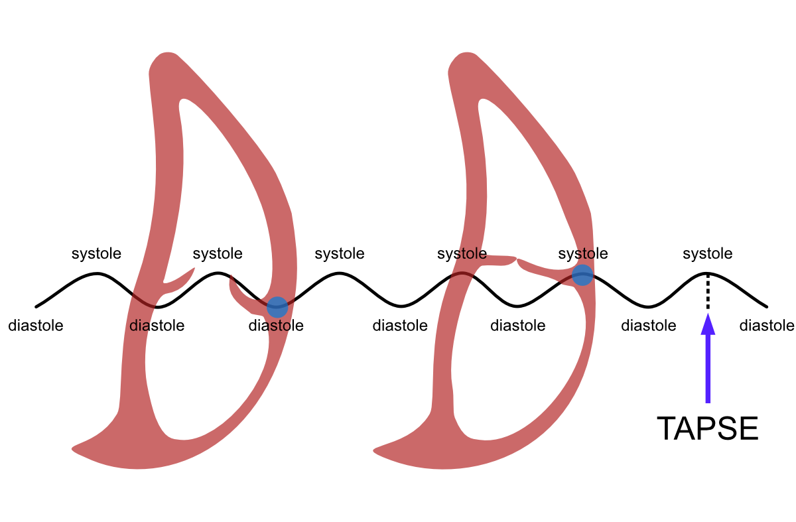

# Right Ventricle

This chapter examines the determination of the right ventricular (RV) systolic function and diameter.

## Systolic Function

Earlier in chapter \@ref(mmoodi), the measurement of the left ventricular basal ejection fraction was covered using [M-mode](#lvmmoodi) and [2D measurements](#lvef2d). In those measurements, a simplification was utilized, according to which ***the left ventricle contracts primarily horizontally***.

For the right ventricle, the opposite simplification can be utilized, according to which ***the right ventricle contracts primarily vertically***. Following this way of thinking, an understanding of the right ventricular systolic function can be obtained by measuring the amplitude of the vertical movement of the lateral corner of the tricuspid annulus. This parameter is called **TAPSE** (*tricuspid annular plane systolic excursion*) (Figure \@ref(fig:tapseaallot)).


<br />

(ref:tapseaallot) Definition of TAPSE. When the observation point (blue ball) is the lateral edge of the tricuspid annulus, the right ventricular movement between diastole and systole draws "sea wave"-like movement. The amplitude of this wave movement is TAPSE.

```{r tapseaallot, out.width = '100%', echo=FALSE, fig.cap="(ref:tapseaallot)"}
 
```

<br />


### TAPSE Measurement

The measurement is performed as follows:

1. A representative four-chamber view is obtained, where a measurement line can be drawn from the heart's apex directly to the lateral edge of the tricuspid annulus

2. M-mode is activated by pressing its button

3. The tricuspid annulus begins to draw a "sea wave," whereupon the hypotenuse is measured from the wave's peak to the wave's base using Caliper button measurement. Note! The echocardiography device doesn't report the hypotenuse but the ***cathetus*** (the amplitude of the wave movement), i.e., TAPSE.

The measurement steps are described below (Figure \@ref(fig:tapse)).


<br />

(ref:tapse) TAPSE measurement using M-mode.

```{r tapse, out.width = '100%', echo=FALSE, fig.cap="(ref:tapse)"}
 knitr::include_graphics("images/tapse.png")
```

<br />

**TAPSE measurement is generally very easy.** The most significant beginner challenges:

- obtaining sufficiently good visibility to the right side of the heart
- distinguishing the tricuspid annulus from other right ventricular structures in the M-mode image.

There is an excellent [The Echo Lady video](https://www.youtube.com/watch?v=jy0YxRagyXo) on YouTube about TAPSE measurement - I can warmly recommend it to beginners.

### TAPSE Reference Range

TAPSE should be 17 mm or above. Values below this are considered suggestive that the right ventricular systolic function is reduced.


## Diameter

The right ventricular diameter is determined in diastole immediately distal to the tricuspid annulus (toward the heart's apex). This basal measurement is abbreviated in the literature as **RVD1**.

Somewhat less commonly encountered in the literature (and even less commonly in the clinic) is the midventricular measurement, which is abbreviated as **RVD2**.


The measurement steps are described below (Figure \@ref(fig:rvd1rvd2)). Measurements are performed using the Caliper button.


<br />

(ref:rvd1rvd2) Performance of RVD1 and RVD2 measurements.

```{r rvd1rvd2, out.width = '100%', echo=FALSE, fig.cap="(ref:rvd1rvd2)"}
 knitr::include_graphics("images/rvd1rvd2.png")
```

<br />

### RV Measurement Reference Ranges

The right ventricle's normal dimensions are presented in the table below \@ref(tab:rvd1rvd2refrange). You can read more about this if you wish from the field's umbrella organizations' recommendation [*Recommendations for Cardiac Chamber Quantification by Echocardiography in Adults*](https://academic.oup.com/ehjcimaging/article/16/3/233/2400086?login=true).


```{r rvd1rvd2refrange, echo=FALSE, warning=FALSE, message=FALSE}
library(tidyverse)
library(kableExtra)


tibble::tribble(
~`Structure described`,  ~`Mean ± SD`,   ~`Reference range`,

"RVD1 (mm)", "33±4", "25-41",
"RVD2 (mm)", "27±4", "19-35"
) -> rvd1rvd2refrange


knitr::kable((rvd1rvd2refrange), 
caption = 'Normal dimensions of the right ventricle')


```


<br/> <br/> <br/>

<p xmlns:cc="http://creativecommons.org/ns#" xmlns:dct="http://purl.org/dc/terms/">

<a property="dct:title" rel="cc:attributionURL" href="https://ukg-opas.netlify.app/">Echo Guidebook</a> © 2022 by <a rel="cc:attributionURL dct:creator" property="cc:attributionName" href="https://www.linkedin.com/in/ville-langen/">Ville Langén</a> is licensed under <a href="https://creativecommons.org/licenses/by-sa/4.0/?ref=chooser-v1" target="_blank" rel="license noopener noreferrer" style="display:inline-block;">CC BY-SA 4.0</a>

</p>
```
